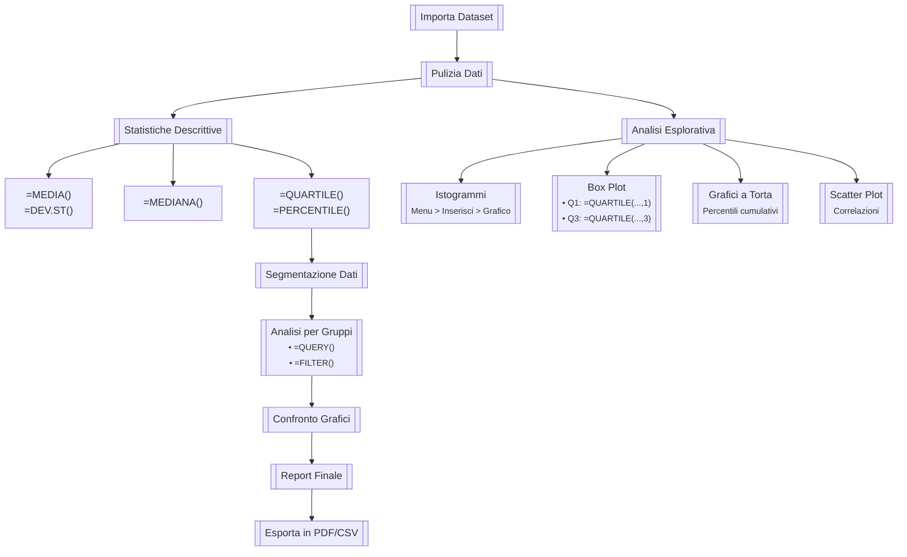

```mermaid
flowchart TD
    A[[" Importa Dataset "]] --> B[[" Pulizia Dati "]]
    B --> C1[[" Statistiche Descrittive "]]
    C1 --> C2["=MEDIA()<br>=DEV.ST()"]
    C1 --> C3["=MEDIANA()"]
    C1 --> C4["=QUARTILE()<br>=PERCENTILE()"]
    B --> D[[" Analisi Esplorativa"]]
    D --> D1[[" Istogrammi<br><small>Menu > Inserisci > Grafico</small>"]]
    D --> D2[[" Box Plot<br><small>• Q1: =QUARTILE(...,1)<br>• Q3: =QUARTILE(...,3)</small>"]]
    D --> D3[[" Grafici a Torta<br><small>Percentili cumulativi</small>"]]
    D --> D4[[" Scatter Plot<br><small>Correlazioni</small>"]]
    C4 --> E[[" Segmentazione Dati"]]
    E --> F[[" Analisi per Gruppi<br><small>• =QUERY()<br>• =FILTER()</small>"]]
    F --> G[[" Confronto Grafici"]]
    G --> H[[" Report Finale"]]
    H --> I[[" Esporta in PDF/CSV"]]
```
