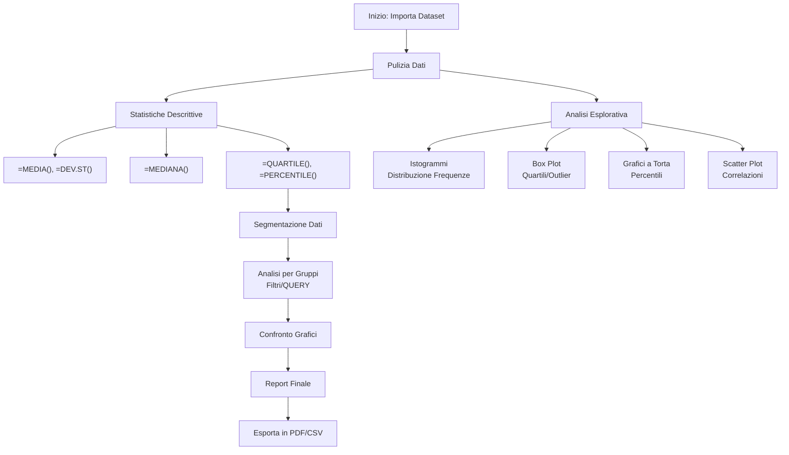

Ecco una **flowchart completa per l'analisi dei dati** in Google Sheets, inclusi i concetti di mediane, percentili e visualizzazioni:

```mermaid
flowchart TD
    A[Inizio: Importa Dataset] --> B[Pulizia Dati]
    B --> C1[Statistiche Descrittive]
    C1 --> C2["=MEDIA(), =DEV.ST()"]
    C1 --> C3["=MEDIANA()"]
    C1 --> C4["=QUARTILE(), =PERCENTILE()"]
    B --> D[Analisi Esplorativa]
    D --> D1[Istogrammi\nDistribuzione Frequenze]
    D --> D2[Box Plot\n(Quartili/Outlier)]
    D --> D3[Grafici a Torta\nPercentili]
    D --> D4[Scatter Plot\nCorrelazioni]
    C4 --> E[Segmentazione Dati]
    E --> F[Analisi per Gruppi\nFiltri/QUERY]
    F --> G[Confronto Grafici]
    G --> H[Report Finale]
    H --> I[Esporta in PDF/CSV]
```

### **🔍 Spiegazione dei Passaggi**:

1. **Pulizia Dati**:
   - Rimuovi duplicati (`=UNIQUE()`)
   - Gestisci valori mancanti (`=SE.NON.DISP()`)
   - Converti formati (`=DATA.VALORE()`, `=TESTO()`)

2. **Statistiche Descrittive**:
   ```excel
   =MEDIA(A2:A100)               // Media
   =MEDIANA(A2:A100)             // Mediana
   =QUARTILE(A2:A100, 1)         // Q1 (25° percentile)
   =PERCENTILE(A2:A100, 0.75)    // 75° percentile
   ```

3. **Visualizzazioni**:
   - **Box Plot**: Mostra min/Q1/mediana/Q3/max
   - **Istogramma**: Distribuzione frequenze (`Menu > Inserisci > Grafico`)
   - **Grafico a torta**: Percentili cumulativi

4. **Tools Integrati**:
   - **Filtri rapidi**: Click destro su intestazione > "Filtro"
   - **Formattazione condizionale** per evidenziare outlier:
     ```excel
     =O(A2<Q1-1.5*IQR, A2>Q3+1.5*IQR)
     ```

### **📊 Esempio di Workflow**:
1. Calcola i quartili:
   ```excel
   =QUARTILE(B2:B100, {0,1,2,3,4})  // Tutti i quartili in una formula
   ```
2. Crea un box plot:
   - Seleziona i dati > Inserisci > Grafico > Box plot
3. Analizza segmenti:
   ```excel
   =QUERY(A2:C100, "SELECT A, AVG(B) WHERE C='Gruppo1' GROUP BY A")
   ```

### **💡 Suggerimenti**:
- Usa **named ranges** per formule complesse:
  ```excel
  =PERCENTILE(dati_vendite, 0.9)
  ```
- Automatizza con **ARRAYFORMULA**:
  ```excel
  =ARRAYFORMULA(SE(B2:B>PERCENTILE(B2:B, 0.9), "Top 10%", ""))
  ```

### **📌 Output Finale**:
| Metriche       | Valore |
|----------------|--------|
| Media          | 45.2   |
| Mediana (Q2)   | 48     |
| Q1             | 32     |
| Q3             | 58     |
| P90            | 85     |

**Grafici consigliati**:
1. Box plot per confrontare gruppi
2. Istogramma con sovrapposta curva normale
3. Mappa di calore per correlazioni


Il messaggio "Mermaid rendering failed" si verifica quando il codice del diagramma di flusso (flowchart) che ho fornito non viene interpretato correttamente dalla piattaforma. Ecco come risolvere:

### **📌 Soluzione Rapida**
1. **Per visualizzare il flowchart**:  
   - Copia il codice sottostante  
   - Incollalo in un editor Mermaid online come [Mermaid Live Editor](https://mermaid.live/)  
   - Oppure usa strumenti che supportano Mermaid (es. Obsidian, Notion, Docs con estensione Mermaid).

2. **Codice corretto del flowchart**:


---

### **📊 Versione Testuale Alternativa**  
Se non puoi usare Mermaid, ecco la struttura in testo:  

1. **Importa Dataset** → **Pulizia Dati**  
   - Rimuovi duplicati (`=UNIQUE()`)  
   - Gestisci valori nulli (`=SE.NON.DISP()`)

2. **Statistiche Descrittive**  
   - Mediana: `=MEDIANA()`  
   - Quartili: `=QUARTILE(range, 1)` (Q1), `3` (Q3)  
   - Percentili: `=PERCENTILE(range, 0.9)` (P90)

3. **Visualizzazioni**  
   - Box Plot: Mostra min/Q1/mediana/Q3/max  
   - Istogramma: Distribuzione frequenze  
   - Grafici a torta: Percentili cumulativi  

4. **Analisi Approfondita**  
   - Segmenta con `=QUERY()` o `=FILTER()`  
   - Confronta gruppi con grafici multipli  

5. **Report Finale**  
   - Esporta tabelle e grafici in PDF  

---

### **💡 Come Usare il Codice in Google Sheets**  
Per implementare concretamente l'analisi:  
- **Calcolo quartili**:  
  ```excel
  =QUARTILE(A2:A100, {0,1,2,3,4})  // Min, Q1, Mediana, Q3, Max
  ```  
- **Box plot**:  
  1. Seleziona i dati  
  2. Menu: **Inserisci > Grafico > Box plot**  

- **Tabelle riassuntive**:  
  | Metrica       | Formula               |  
  |---------------|-----------------------|  
  | Mediana       | `=MEDIANA(A2:A100)`   |  
  | P90           | `=PERCENTILE(A2:A100, 0.9)` |  

---

Se hai bisogno di adattare il flowchart a un caso specifico, fammelo sapere! 😊