```mermaid
flowchart TD
    A[["📥 Inizio: Importa Dataset<br><small><i>File > Importa > Carica CSV/Excel</i></small>"]] --> B[["🧹 Pulizia Dati<br><small>• =UNIQUE()<br>• =SE.NON.DISP()<br>• =TRIM()</small>"]]
    B --> C1[["📊 Statistiche Descrittive"]]
    C1 --> C2["=MEDIA()<br>=DEV.ST()"]
    C1 --> C3["=MEDIANA()"]
    C1 --> C4["=QUARTILE()<br>=PERCENTILE()"]
    B --> D[["🔍 Analisi Esplorativa"]]
    D --> D1[["📈 Istogrammi<br><small>Menu > Inserisci > Grafico</small>"]]
    D --> D2[["📦 Box Plot<br><small>• Q1: =QUARTILE(...,1)<br>• Q3: =QUARTILE(...,3)</small>"]]
    D --> D3[["🥧 Grafici a Torta<br><small>Percentili cumulativi</small>"]]
    D --> D4[["✂ Scatter Plot<br><small>Correlazioni</small>"]]
    C4 --> E[["🗂 Segmentazione Dati"]]
    E --> F[["👥 Analisi per Gruppi<br><small>• =QUERY()<br>• =FILTER()</small>"]]
    F --> G[["🆚 Confronto Grafici"]]
    G --> H[["📑 Report Finale"]]
    H --> I[["💾 Esporta in PDF/CSV"]]
```

---

### **🔧 Formule Google Sheets da Copiare**
```excel
// PULIZIA DATI
=UNIQUE(A2:A100)                          // Rimuove duplicati
=ARRAYFORMULA(SE(A2:A="", "N/D", A2:A))  // Gestisce celle vuote

// STATISTICHE
=MEDIA(B2:B100)                           // Media
=MEDIANA(B2:B100)                         // Mediana
=QUARTILE(B2:B100, {0,1,2,3,4})          // Tutti i quartili
=PERCENTILE(B2:B100, 0.9)                 // 90° percentile

// ANALISI PER GRUPPI
=QUERY(A2:C100, "SELECT A, AVG(B) WHERE C='Gruppo1' GROUP BY A")
```

---

### **📌 Istruzioni per Obsidian**
1. **Installa il plugin Mermaid** (se non già fatto):
   - Impostazioni > Community plugins > Cerca "Mermaid" > Installa
2. **Crea una nuova nota** e incolla il codice sopra
3. **Attiva la preview** per vedere il flowchart interattivo

---

### **🎨 Personalizzazione**
- Per modificare il flowchart, aggiorna i nodi tra `[[ ]]`  
- Aggiungi nuove formule nelle sezioni dedicate  
- Usa `<br>` per andare a capo nei box

---

### **📁 Esempio di Struttura in Obsidian**
```markdown
# Analisi Dati Workflow
```mermaid
flowchart...
```

## Formule Utili
```excel
=MEDIA(...)
```

## Dataset
- [[Dataset.csv]]
```

Se hai bisogno di adattare il diagramma al tuo caso specifico, fammelo sapere! 😊