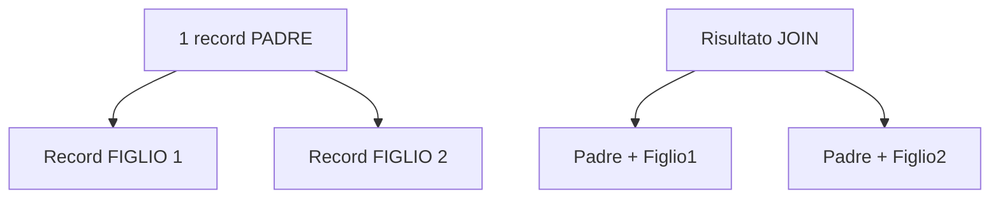

# Indice

- [[#Query con LEFT JOIN]]
- [[#Cosa Osservare]]
- [[#Perche' si duplicano da padre a figlio?]]
- 

i join in gerarchie si fanno per capire se le relazioni 
se vado verso il figlio meglio usare una [[IN]] 

si possono concatenare tutte le join che vuoi 

quando faccio una left join se non associo con la tabella di destra sono null
posso controllare se c'e' uno almeno null
pero' la cosa piu' sicura da fare e' controlloare che la chiave di join non sia null e me la controllo nella tabella di destra e cosi' sono sicuro che non mi becco le righe errate
(la chiave di join e' la chiave "esterna")

```sql
-- Trova titolo traccia + titolo album
SELECT Track.Name AS Canzone, Album.Title AS Album
FROM Track
JOIN Album ON Track.AlbumId = Album.AlbumId  -- << COLLEGAMENTO CHIAVE
WHERE Track.TrackId = 23
```

SELECT colonne
FROM tabA
JOIN tabB
ON tabA.colonnaX = tabB.colonnaX

per concatenare


serve per legare inseme le informazioni

aggiunge colonne

join e' INNER di default

tipi di JOIN

INNER JOIN lega inseme due tabelle, prende solo le righe che matchano da entrambe le parti, le altre vengono scartate

LEFT JOIN prende tutti i valori delle righe della tb a sx, cioe' la prima tabella e le tabelle senza corrispondenza da NULL

RIGHT JOIN

```sql
SELECT colonne
FROM tabella1
JOIN tabella2 ON condizione1
JOIN tabella3 ON condizione2
JOIN tabella4 ON condizione3
...
WHERE filtri_opzionali;```


ANTIJOIN !=


![[Pasted image 20250717163706.png]]

![[Pasted image 20250717163638.png]]

## ** CLASSICA LEFT JOIN** 

![[Pasted image 20250718172451.png]]


### Spiegazione da LLM

Ecco una spiegazione semplice di **LEFT JOIN** con un esempio preso dal codice di **SQLite** (noto per la sua eleganza e semplicità), usando tabelle immaginarie ma realistiche:

---

### **Concetto Base**  
Un `LEFT JOIN` mantiene **tutti i record della tabella a sinistra**, anche se non hanno corrispondenza nella tabella a destra. I campi senza corrispondenza avranno valori `NULL`.

---

### **Esempio Pratico**  
Immagina due tabelle dal codice sorgente di SQLite:  
1. **`commits`** (contiene tutti i commit)  
2. **`contributors`** (contiene i dettagli dei contributori)  

```sql
-- Tabella commits
| commit_hash | message               | author_id |
|-------------|-----------------------|-----------|
| a1b2c3      | Fix memory leak       | 101       |
| d4e5f6      | Optimize query parser | 102       |
| g7h8i9      | Update documentation  | NULL      |

-- Tabella contributors
| id  | name          | email               |
|-----|---------------|---------------------|
| 101 | Richard Hipp  | rh@sqlite.org       |
| 102 | D. Richard    | dr@sqlite.org       |
```

---

### **Query con LEFT JOIN**  
```sql
SELECT 
    c.commit_hash,
    c.message,
    co.name AS author_name
FROM 
    commits c
LEFT JOIN 
    contributors co ON c.author_id = co.id;
```

### **Risultato**  
| commit_hash | message               | author_name   |
|-------------|-----------------------|---------------|
| a1b2c3      | Fix memory leak       | Richard Hipp  |
| d4e5f6      | Optimize query parser | D. Richard    |
| g7h8i9      | Update documentation  | NULL          |

---

### **Cosa Osservare**  
1. Il commit `g7h8i9` è incluso nel risultato **nonostante non abbia un autore corrispondente** (il campo `author_name` è `NULL`).  
2. Con un `INNER JOIN`, quel record sarebbe stato escluso.  

---

### **Perché SQLite usa questo approccio?**  
Nel suo codice, SQLite usa spesso `LEFT JOIN` per:  
- Trovare **record orfani** (es.: commit senza autore).  
- Gestire casi edge **senza perdere dati**.  

---

### **Esempio Reale**  
Nel codice di SQLite, troverai join simili per:  
```sql
-- Es: Cerca tabelle con eventuali indici mancanti
SELECT 
    tbl.name AS table_name,
    idx.name AS index_name
FROM 
    sqlite_master tbl
LEFT JOIN 
    sqlite_master idx ON tbl.name = idx.tbl_name AND idx.type = 'index'
WHERE 
    tbl.type = 'table' AND idx.name IS NULL;
```
*(Trova tabelle senza indici, mantenendo tutte le tabelle nel risultato)*  

---

### **Analogia Semplice**  
Pensa a una **festa**:  
- `LEFT JOIN` = Tutti gli invitati (tabella sinistra), anche chi non ha portato un regalo (tabella destra).  
- `INNER JOIN` = Solo gli invitati con regalo.  

Vuoi provare con un esempio dal tuo codice? Posso aiutarti a costruire una query!

---
### Perche' si duplicano da padre a figlio?

### Perché le righe si duplicano in un JOIN padre → figlio?

Il problema nasce dalla **cardinalità della relazione**. Ecco cosa succede:

#### Caso tipico (1:N)
```
┌───────────┐       ┌───────────┐
│  PADRE    │       │   FIGLIO  │
├───────────┤       ├───────────┤
│ PK id     │───1:N─│ FK pad_id │
│ nome      │       │ dati      │
└───────────┘       └───────────┘
```

**Esempio concreto**:
```sql
SELECT p.id, p.nome, f.dati
FROM padre p
JOIN figlio f ON p.id = f.pad_id;
```

| id | nome  | dati       |
|----|-------|------------|
| 1  | Mario | Record A   |
| 1  | Mario | Record B   | ← Duplicato!
| 2  | Laura | Record C   |

---

### 3 Motivi principali delle duplicazioni:

1. **Molti figli per un padre** (relazione 1:N)
   - Ogni record figlio crea una riga distinta

2. **Dati NULL o JOIN mal definiti**
   ```sql
   -- Se la condizione di JOIN è troppo larga:
   ON p.id = f.pad_id OR p.nome LIKE '%a%'
   ```

3. **Tabelle ponte** (relazioni M:N)
   ```sql
   -- Esempio con tabella intermedia
   SELECT p.*, f.*
   FROM padre p
   JOIN padre_figlio pf ON p.id = pf.padre_id
   JOIN figlio f ON pf.figlio_id = f.id
   ```

---

### Soluzioni pratiche:

#### 1. Usa DISTINCT (se vuoi eliminare duplicati)
```sql
SELECT DISTINCT p.id, p.nome
FROM padre p
JOIN figlio f ON p.id = f.pad_id;
```

#### 2. Aggrega i figli con STRING_AGG (PostgreSQL)
```sql
SELECT 
    p.id,
    p.nome,
    STRING_AGG(f.dati, ', ') AS tutti_i_figli
FROM padre p
LEFT JOIN figlio f ON p.id = f.pad_id
GROUP BY p.id, p.nome;
```

#### 3. Filtra con una sottoquery
```sql
SELECT p.*
FROM padre p
WHERE p.id IN (
    SELECT DISTINCT pad_id 
    FROM figlio
    WHERE /* condizioni */
);
```

#### 4. Usa LEFT JOIN LATERAL (PostgreSQL)
```sql
SELECT p.*, f.*
FROM padre p
LEFT JOIN LATERAL (
    SELECT * 
    FROM figlio 
    WHERE pad_id = p.id
    LIMIT 1  -- Prendi solo un figlio
) f ON true;
```

---

### Quando è *normale* avere duplicati:
1. **Report dettagliati** (1 riga padre × N righe figli)
2. **Esportazioni per ETL**
3. **Statistiche** (conteggi per ogni figlio)

---

### Esempio reale in un e-commerce:
```sql
-- Query "problematica"
SELECT 
    o.order_id,
    o.date,
    i.product_id
FROM orders o
JOIN order_items i ON o.order_id = i.order_id;
```
**Risultato**:
| order_id | date       | product_id |
|----------|------------|------------|
| 1001     | 2023-01-01 | A123       |
| 1001     | 2023-01-01 | B456       | ← Ordine duplicato!
| 1002     | 2023-01-02 | C789       |

**Soluzione**:
```sql
-- Versione corretta per lista ordini
SELECT DISTINCT o.order_id, o.date
FROM orders o;
```

**Versione per report dettagliato** (duplicati voluti):
```sql
SELECT 
    o.order_id,
    o.date,
    i.product_id,
    i.quantity
FROM orders o
JOIN order_items i ON o.order_id = i.order_id;
``` 

---

### Diagramma del problema:


Se vuoi evitare duplicati, devi **ridefinire cosa intendi per "riga univoca"** nel tuo risultato.