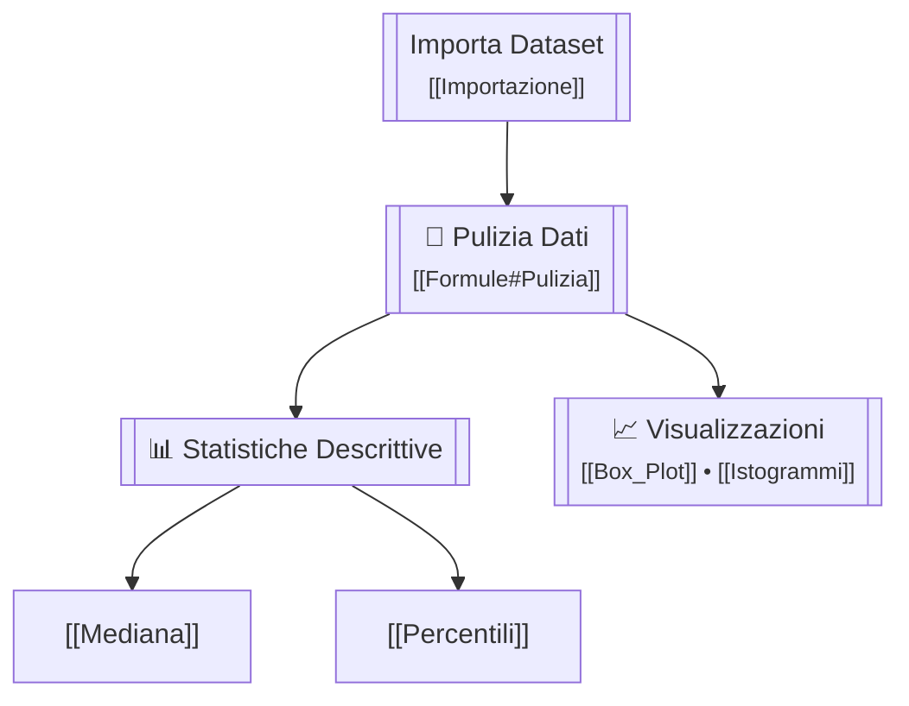

```mermaid
flowchart TD
    A[["Importa Dataset<br><small>[[Importazione]]</small>"]] --> B[["🧹 Pulizia Dati<br><small>[[Formule#Pulizia]]</small>"]]
    B --> C1[["📊 Statistiche Descrittive"]]
    C1 --> C2["[[Mediana]]"]
    C1 --> C3["[[Percentili]]"]
    B --> D[["📈 Visualizzazioni<br><small>[[Box_Plot]] • [[Istogrammi]]</small>"]]
```
