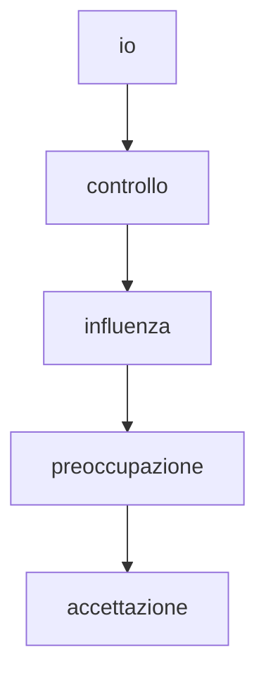

[[causa/effetto]]

io > controllo > influenza > preoccupazione (accettazione)

Cosa posso fare io di diverso?

oggi la lezione su causa-effetto mi ha fatto pensare a Spinoza che ha fatto della chiarezza delle passioni/emozioni 
«La potenza di un uomo, in quanto la sua essenza è spiegata per la sola ragione, è la sua stessa virtù. E perciò, quanto più uno è in grado di agire secondo la ragione, tanto più è libero.» (Etica, Parte IV, Prop. 67, Corollario)