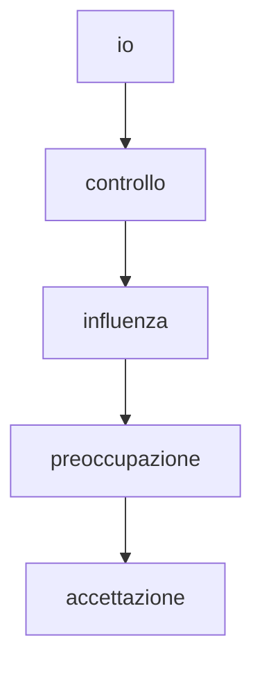

[[#La Pragmatica della Comunicazione Umana]]

[[causa/effetto]]

io > controllo > influenza > preoccupazione (accettazione)

Cosa posso fare io di diverso?

oggi la lezione su causa-effetto mi ha fatto pensare a Spinoza che ha fatto della chiarezza delle passioni/emozioni 
«La potenza di un uomo, in quanto la sua essenza è spiegata per la sola ragione, è la sua stessa virtù. E perciò, quanto più uno è in grado di agire secondo la ragione, tanto più è libero.» (Etica, Parte IV, Prop. 67, Corollario)

--- 

# La Pragmatica della Comunicazione Umana

# I Cinque Assiomi della Comunicazione

**Teoria di Paul Watzlawick e la Scuola di Palo Alto**

---

## 1. È impossibile non comunicare
> **"Non si può non comunicare"**

- **Concetto chiave**: Tutto il comportamento è comunicazione
- Anche il silenzio, l'evitare lo sguardo o l'immobilità sono messaggi
- L'assenza di comportamento verbale ≠ assenza di comunicazione

**Esempio pratico**:
- Su un treno, girare la testa verso il finestrino → "Non voglio interagire"

---

## 2. Aspetto di contenuto e di relazione
> **Ogni messaggio ha due livelli**

### Livello di Contenuto (IL COSA)
- Informazioni oggettive, dati
- Aspetto verbale/digitale

### Livello di Relazione (IL COME)
- Definisce la natura del rapporto
- Come deve essere interpretato il contenuto
- Comunicazione non verbale e paraverbale

**Esempio**:
- "Vieni qui" con tono dolce → relazione positiva
- "Vieni qui" con tono aggressivo → relazione di potere

---

## 3. La punteggiatura della sequenza
> **Organizzazione soggettiva degli eventi**

- Ogni persona "punteggia" diversamente la sequenza comunicativa
- Tendenza a vedere il proprio comportamento come REAZIONE
- Fonte di molti conflitti relazionali

**Esempio ciclo vizioso**:
- Lui: "Mi ritiro **perché** lei critica"
- Lei: "Critico **perché** lui si ritira"
- → Chi inizia veramente?

---

## 4. Comunicazione digitale e analogica
> **Due linguaggi diversi**

### Modo Digitale
- Codice verbale (parole)
-  Preciso e logico
-  Povero per emozioni

### Modo Analogico
-  Comunicazione non verbale
- Ricco di emozioni
-  Ambiguo

**Esempio di incongruenza**:
- "Non sono arrabbiato" (digitale) + braccia conserte e tono secco (analogico)
- → Si tende a credere di più al messaggio analogico

---

## 5. Scambio simmetrico e complementare
> **Tipi di relazione comunicativa**

### Comunicazione Simmetrica
-  Basata sull'uguaglianza
- Comportamento speculare
- Minimizza le differenze
- *Esempio: due colleghi che collaborano*

### Comunicazione Complementare
-  Basata sulla differenza
- Posizioni One-Up / One-Down
- Non necessariamente negativa
- *Esempio: relazione medico-paziente*

PENSO AD UNA SITUAZIONE IN CUI MI SONO SENTITO ASCOLTATO

mattina con amica

mi  stava guardando e annuendo

non mi interrompeva ma anzi approfindiva le domande

aggiungeva le sue ipotesi sul fatto sottilineando che erano ipotesi
