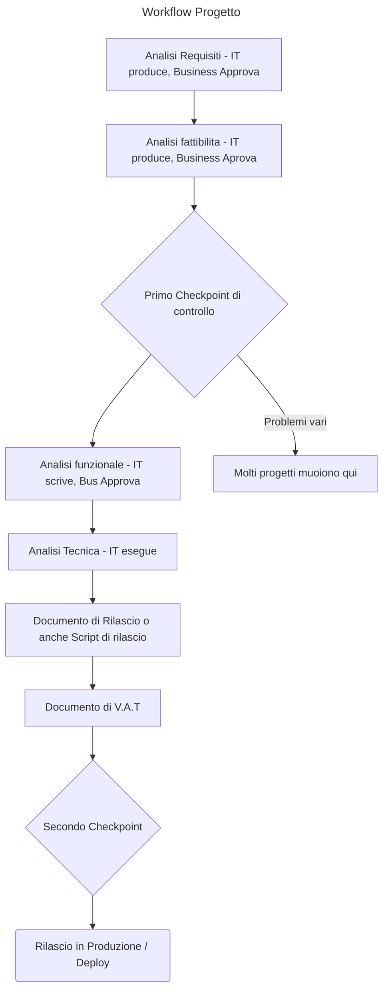

Analisi Requisti > la scrive il Business
Analisi Fattibilita' > It la scrive - Business appprova
CHECKPOINT <> nel workflow

Analisi Funzionale > scrive IT > approva Business

Analisi Tecnica > IT

Documento di Rilascio - Script di rilascio in altenativa
- Manuale utente
- Manuale di esercizio

	Documento di V.A.T.
checkpoint

rilascio in produzione (Deploy)

Descriptive Analytics

Predictive Analytics

Prescriptive Analytics

